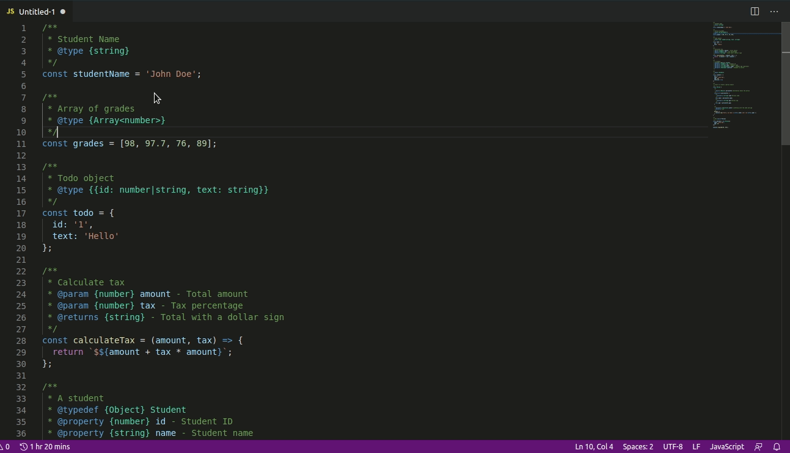

# jsdoc-live-preview

A simple extension for preview jsdoc using markdown

## Installation

Run `ext install jsdoc-live-preview` in the command palette.

## Usage

Open `.js` file

Open command palette with `shift + command/ctrl + p`

type `>` select `JSDoc: Show Preview`

Run `JSDoc: Show Preview` in the command palette by hitting `enter`

